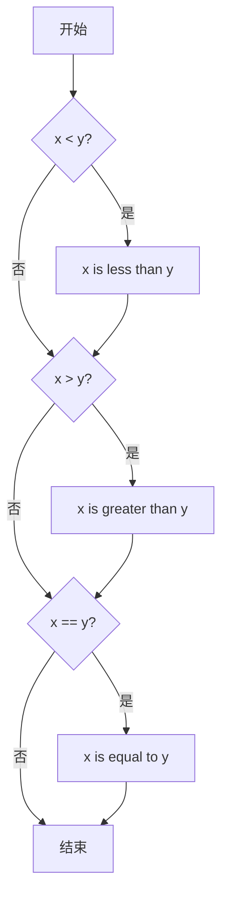
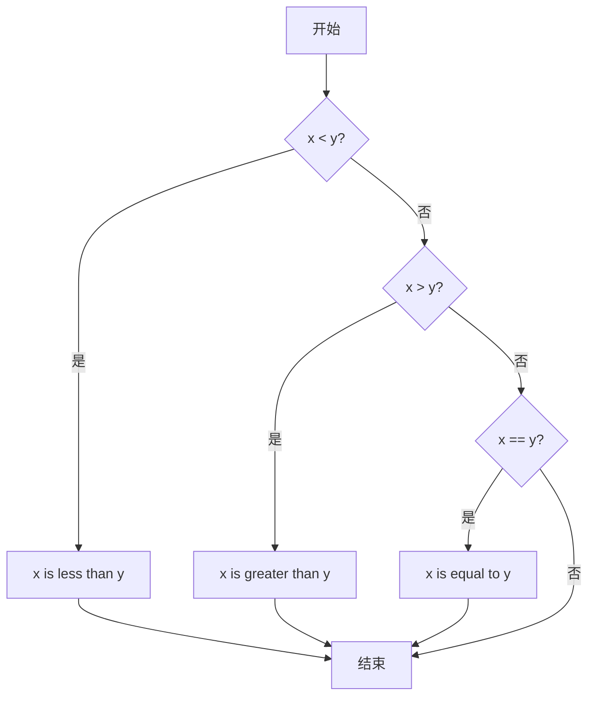
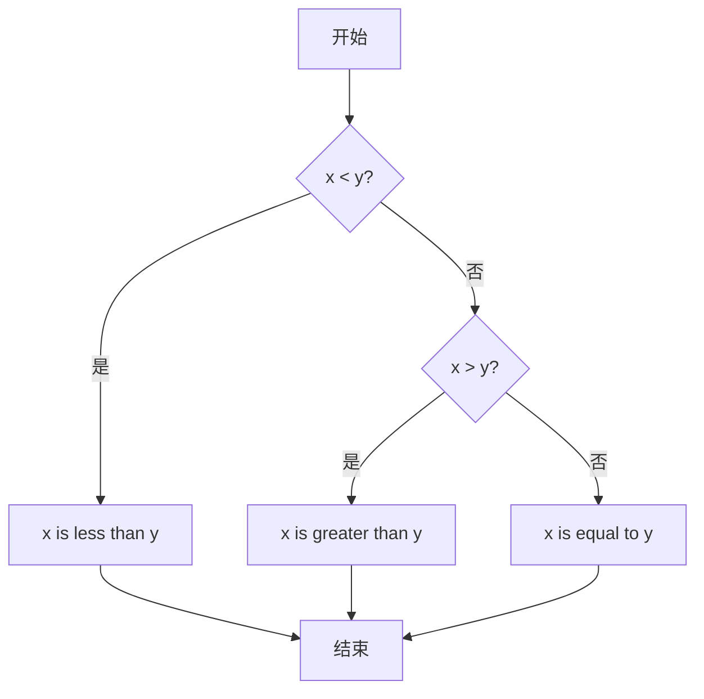

# CS50P Lecture 1 条件语句

# 官方课程地址
https://cs50.harvard.edu/python/weeks/1/

## Conditionals
条件语句允许程序员让你的程序做出决定：就好像你的程序可以根据某些条件选择走左边的路还是右边的路一样。  
条件语句允许你的程序根据指定的条件做出决策，选择一条路径而不是另一条路径。  
Python 内置了一组"运算符"，用于提出数学问题。

> **运算符说明**：
> - `>` 和 `<` 表示"大于"和"小于"。
> - `>=` 表示"大于或等于"。
> - `<=` 表示"小于或等于"。
> - `==` 表示"等于"（双等号，单等号是赋值）。
> - `!=` 表示"不等于"。
> - 条件语句将左边的项与右边的项进行比较。

---

## if Statements
```python
x = int(input("What's x? "))
y = int(input("What's y? "))

if x < y:
    print("x is less than y")
```

**关键点**：`if` 语句使用 bool 值（True/False）决定是否执行代码。

---

## Control Flow, elif, and else 

### 1. 原始代码（三个独立 if 语句）
```python
x = int(input("What's x? "))
y = int(input("What's y? "))

if x < y:
    print("x is less than y")
if x > y:
    print("x is greater than y")
if x == y:
    print("x is equal to y")
```

**流程图**：


> **问题**：三个条件独立判断，效率低

---

### 2. 优化代码（使用 elif）
```python
x = int(input("What's x? "))
y = int(input("What's y? "))

if x < y:
    print("x is less than y")
elif x > y:
    print("x is greater than y")
elif x == y:
    print("x is equal to y")
```

**流程图**：


> **改进**：条件判断按顺序执行，一旦满足条件就跳过后续判断

---

### 3. 最终优化（使用 else）
```python
x = int(input("What's x? "))
y = int(input("What's y? "))

if x < y:
    print("x is less than y")
elif x > y:
    print("x is greater than y")
else:
    print("x is equal to y")
```

**流程图**：


> **关键改进**：
> 1. 减少条件判断次数（从3个→2个）
> 2. 逻辑更清晰（else 作为兜底）
> 3. 效率提升（服务器处理海量计算时至关重要）

---

## or
```python
# 优化前
if x < y or x > y:
    print("x is not equal to y")
else:
    print("x is equal to y")

# 优化后（更高效）
if x != y:
    print("x is not equal to y")
else:
    print("x is equal to y")
```

> **关键点**：`!=` 直接判断"不等于"，避免冗余条件

---

## and
```python
# 优化前
if score >= 90 and score <= 100:
    print("Grade: A")

# 优化后（Pythonic）
if 90 <= score <= 100:
    print("Grade: A")

# 最终优化（减少条件判断）
if score >= 90:
    print("Grade: A")
elif score >= 80:
    print("Grade: B")
# ... 其他条件 ...
```

> **关键点**：减少条件判断次数，提升代码可读性

---

## Modulo 
**模运算符 `%`**：判断两数是否整除（余数是否为0）
- `4 % 2 = 0`（整除）
- `3 % 2 = 1`（有余数）

**奇偶性判断**：
```python
x = int(input("What's x? "))

if x % 2 == 0:
    print("Even")
else:
    print("Odd")
```

---

## Creating Our Own Parity Function 
```python
def main():
    x = int(input("What's x? "))
    if is_even(x):
        print("Even")
    else:
        print("Odd")

def is_even(n):
    if n % 2 == 0:
        return True
    else:
        return False

main()
```

---

## Pythonic
**终极优化写法**：
```python
def main():
    x = int(input("What's x? "))
    if is_even(x):
        print("Even")
    else:
        print("Odd")

def is_even(n):
    return n % 2 == 0  # 直接返回布尔值

main()
```

> **关键点**：`n % 2 == 0` 会自动返回 `True`/`False`，无需显式 `if-else`

---

## match
```python
name = input("What's your name? ")

match name: 
    case "Harry" | "Hermione" | "Ron":
        print("Gryffindor")
    case "Draco":
        print("Slytherin")
    case _:
        print("Who?")
```

> **关键点**：
> - `|` 符号表示"或"（类似 `or`）
> - `case _` 作为默认匹配（等效 `else`）
> - Python 3.10+ 特性